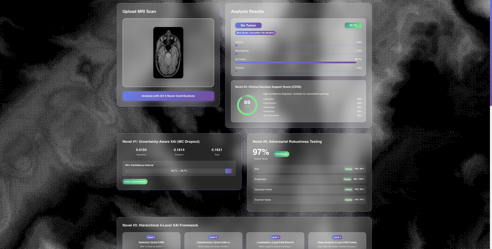
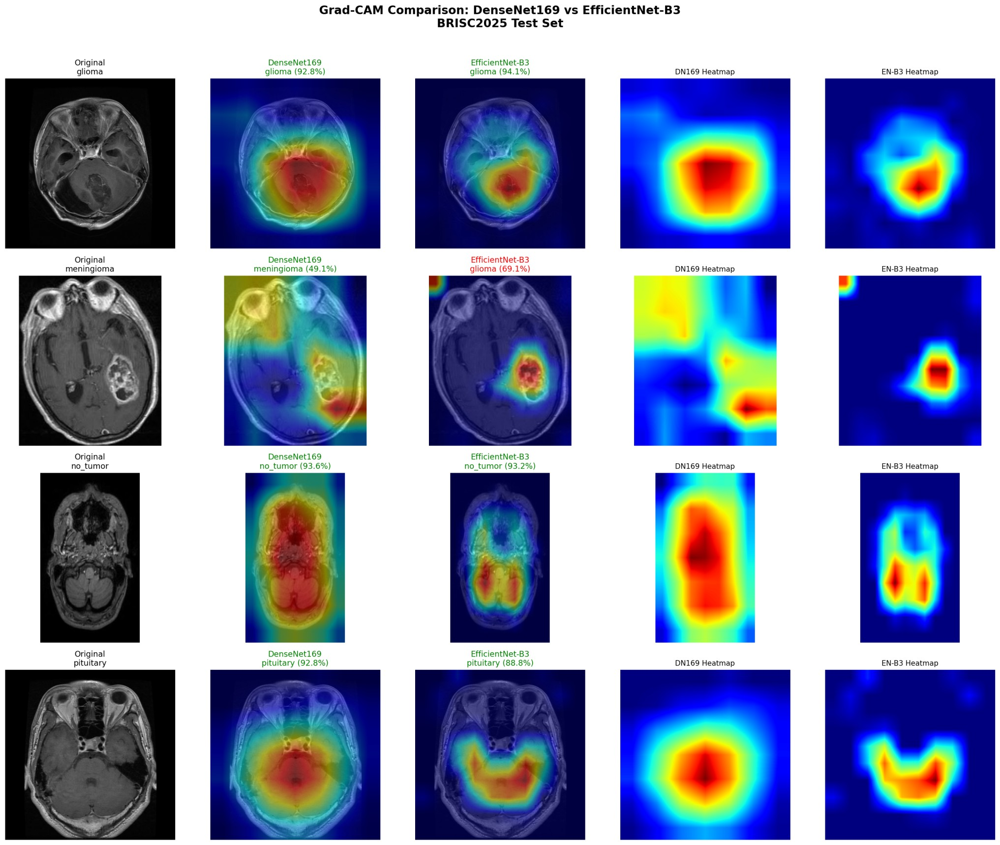

# Brain Tumor MRI Classification & Visual Explainability System

An interactive deep learning application for brain tumor classification from T1-weighted MRI scans with multi-level visual explainability and confidence scoring.

---

## 🚀 Live Interactive Demo

Test the interactive system live in your browser on Hugging Face Spaces:  
👉 **[Launch Live Demo on Hugging Face](https://huggingface.co/spaces/abubokkor-cse/brain-tumor-detection)**

*No installation, local GPU, or weight downloads required.*

---

## 🌟 Application Features

- **Multi-Class Tumor Analysis:** Evaluates MRI scans across four diagnostic classes:
  - Glioma
  - Meningioma
  - Pituitary Tumor
  - Healthy (No Tumor)
- **Visual Attention Heatmaps:** Displays class activation maps (CAM) to highlight the spatial anatomical regions influencing the network's prediction.
- **Uncertainty & Risk Tiers:** Translates raw model likelihoods into calibrated clinical decision tiers (Low, Medium, High review priority).
- **Comparative Multi-Architecture View:** Simultaneously evaluates inputs across complementary convolutional backbones.

---

## 🖥️ User Interface Preview

---

## 🔬 Multi-Level Visual Explainability (CAM)

The application produces layered visual explanations to help clinicians examine feature attribution across network depths:

---

## 📧 Contact

For academic inquiries, collaborations, or questions regarding the project:
- **Author:** Md. Abu Bokkor
- **Email:** `abubokkor.cse@gmail.com`
- **Hugging Face:** [@abubokkor-cse](https://huggingface.co/abubokkor-cse)

---

## 📄 License

This project is licensed under the MIT License - see the [LICENSE](LICENSE) file for details.
